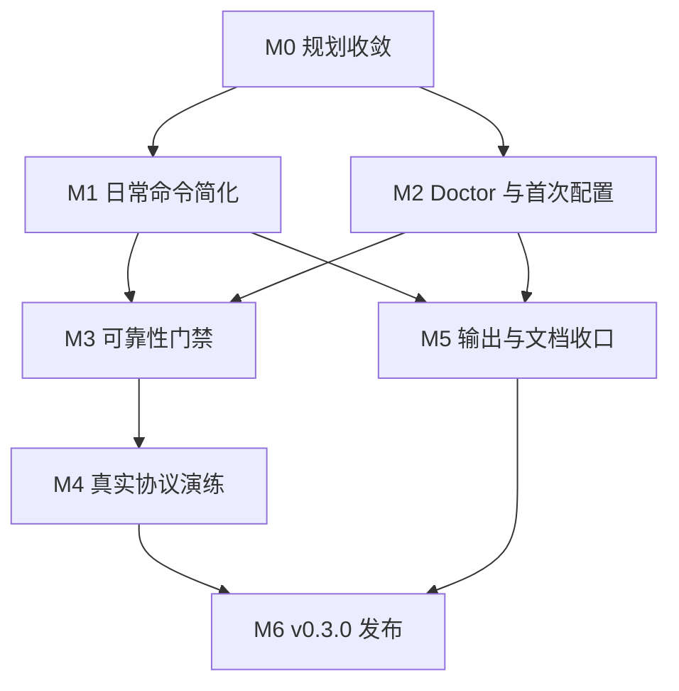

# git-deploy v0.3 简化稳定版：深度原子 TODO 与实施计划

> 文档状态：实施基准草案
> 制定日期：2026-07-14
> 适用仓库：`howjc/git-deploy`
> 基线分支：`main`
> 基线提交：`929162398e6a3bb3ddd63af1ffa3c99a75e90caf`
> 当前稳定版本：`v0.2.1`
> 当前自动测试基线：321 项
> 目标版本：`v0.3.0`（简化、稳定、适合个人长期使用）

---

## 0. 文档目的

本文档将 `git-deploy` 后续工作拆成可直接交给 Codex、Claude 或人工开发者执行的原子任务。

本文档不是在原有 v0.3 TUI 计划上继续追加任务，而是根据实际使用场景重新设定优先级：

> 使用 Git revision 管理多个长期维护项目，以 SFTP/FTP/FTPS 替代手工 FTP 发布；日常操作越简单越好，但部署失败必须可诊断、可恢复、可回滚。

每个原子任务原则上应满足：

1. 只有一个主要目标；
2. 能以一个独立提交或一个小型 PR 完成；
3. 有明确输入、输出和完成定义；
4. 有可执行自动测试，或明确的人工验收步骤；
5. 不顺带引入未规划的新能力；
6. 单个任务预计不超过 1 个开发日，超过时必须再次拆分。

---

## 1. 当前基线判断

### 1.1 已经具备且应继续保留的能力

当前仓库已经拥有以下高价值核心能力，不应重复实现或为了“简化”而删除：

- Git commit、连续 range、非连续 selector 的精确变更计算；
- named remote 与 physical target identity；
- target 级本地锁；
- expected state、generation、CAS、持久化 Git tree；
- durable transaction journal；
- 部署前真实远端 bytes 备份；
- 上传后 hash 验证；
- 部署失败自动恢复；
- 最新成功 deployment 回滚；
- remote drift 检测；
- SFTP、FTP、FTPS；
- SFTP owner/group/mode；
- Host/Docker artifact build；
- 1Password CLI 构建环境变量注入；
- CLI 与 UI 无关的 application request/result/event/service 层；
- 同一 physical target mutation 互斥与重复执行幂等保护。

### 1.2 当前主要问题

当前问题不是“缺少底层能力”，而是：

1. 日常部署仍要求显式填写 `--revisions`，与“一条命令上线”的目标有距离；
2. CLI 暴露了大量状态迁移、恢复和构建概念，新用户认知成本偏高；
3. 缺少统一的 `doctor` 诊断入口；
4. 现有测试大量覆盖 contract 和 fake transport，但仍需要真实 SFTP/FTP/FTPS 环境演练；
5. 原有 v0.3 计划继续建设 TUI、非最新回滚和引用可达性 GC，收益与个人使用目标不匹配；
6. 状态损坏、备份缺失、残留 transaction 等问题虽然能在部分路径报错，但缺少面向使用者的一次性诊断报告；
7. README 更像完整技术手册，缺少面向日常使用的最短路径。

### 1.3 本轮核心决策

| 能力 | 决策 | 说明 |
|---|---|---|
| CLI | 继续作为唯一稳定主入口 | 适合本地、SSH、脚本和 CI |
| application service 层 | 保留并冻结边界 | 已实现且测试充分，不再为未来 UI 继续抽象 |
| TUI | 冻结 | 当前收益不足以覆盖依赖、测试和维护成本 |
| 非最新回滚 | 冻结 | 最新回滚已满足主要故障恢复场景 |
| 引用可达性 GC | 冻结 | 先通过容量报告与人工清理指导解决，暂不承担自动删除风险 |
| Host/Docker build | 保留兼容，不扩展 | 现有 PHP/Node 项目仍可能需要，但不继续发展成流水线系统 |
| FTP/FTPS | 保留兼容 | 旧项目可能仍依赖；新增能力优先 SFTP |
| Web UI / 多用户 / 审批 | 明确不做 | 不符合个人工具定位 |
| 数据库迁移自动回滚 | 明确不做 | 数据库及外部系统不属于文件事务边界 |

---

## 2. v0.3 北极星与验收口径

### 2.1 北极星

> 在已有事务和状态引擎之上，把日常发布收敛为一条容易理解、容易诊断、失败可恢复的命令。

理想日常流程：

```text
修改代码
  ↓
git commit
  ↓
git-deploy deploy application --remote prod
  ↓
显示 current → HEAD 的精确计划
  ↓
确认
  ↓
备份、上传、验证、提交 state
  ↓
成功；失败则自动恢复并给出下一步操作
```

### 2.2 v0.3 发布级验收标准

v0.3.0 发布前必须满足：

1. 已存在可信 current state 时，`plan` 和 `deploy` 可省略 `--revisions`，默认计算 current → HEAD；
2. 没有可信 current state 时，不得猜测基线，必须明确提示 bootstrap 或显式 selector；
3. `rollback PROJECT` 默认回滚最新成功 deployment，不再强制输入 `--latest`；
4. 新增 `doctor`，可以检查本地配置、Git、state、backup、transaction 与远端只读连接；
5. 同一 physical target 的跨进程并发部署有自动测试证明会被阻断；
6. 上传、权限、hook、health、journal、state commit 任一步失败均有故障注入测试；
7. 至少有真实 SFTP 集成测试，验证上传、原子替换、权限、删除、回滚；
8. FTP/FTPS 至少完成协议兼容 smoke；
9. 所有错误输出包含阶段和建议动作，但不泄漏密码、token、1Password reference 或 secret value；
10. README 首页能在 5 分钟内指导完成安装、初始化、首次 bootstrap、日常部署和最新回滚；
11. 原有 CLI 需要显式 selector 的调用方式仍兼容；
12. 全量测试、lint、type check、build、隔离安装 smoke 全部通过。

---

## 3. 版本切片与依赖关系

### 3.1 发布切片

| 里程碑 | 名称 | 目标 |
|---|---|---|
| M0 | 规划收敛 | 冻结旧扩张计划，确立产品边界 |
| M1 | 日常命令简化 | 减少每次部署需要输入和理解的参数 |
| M2 | Doctor 与首次配置 | 降低初始化和故障定位成本 |
| M3 | 可靠性门禁 | 验证已有锁、事务、恢复和状态引擎 |
| M4 | 真实协议演练 | 在真实 SFTP/FTP/FTPS 服务上验证 |
| M5 | 输出与文档收口 | 让错误、历史和操作提示适合长期使用 |
| M6 | v0.3.0 发布 | 冻结接口并完成用户验收 |

### 3.2 总体依赖图



---

## 4. 任务执行规范

### 4.1 状态枚举

- `待办`：尚未开始；
- `进行中`：已开始，且有明确分支或工作目录；
- `受阻`：无法完成 DoD，必须记录原因；
- `待人工验收`：自动验证完成，但需要真实环境确认；
- `已完成`：全部 DoD 已执行并保留结果。

### 4.2 任务大小

| 大小 | 建议耗时 | 要求 |
|---|---:|---|
| XS | ≤ 30 分钟 | 文档、小型断言、单一错误信息 |
| S | ≤ 2 小时 | 一个小功能或一组相邻测试 |
| M | ≤ 4 小时 | 一个完整但边界清晰的服务/适配器 |
| L | ≤ 1 天 | 只允许用于真实集成环境；超过必须拆分 |

### 4.3 每个任务的通用 DoD

除任务专属 DoD 外，所有代码任务都必须：

```bash
uv run pytest <相关测试> -q
uvx ruff check <修改范围>
uvx ty check src
```

若修改打包、依赖或入口，还必须：

```bash
uv lock --check
uv build --clear
```

禁止：

- 未运行测试直接标记完成；
- 为通过测试而降低安全门禁；
- 修改生产服务器完成自动测试；
- 把真实 secret 写入 fixture、日志或快照；
- 顺带实现本任务之外的功能；
- 手工编辑 `uv.lock`。

---

# 5. M0：规划收敛

## EPIC M0-A：冻结旧扩张计划

### GD-M0-001：新增简化版北极星文档

- **优先级**：P0
- **大小**：S
- **目标**：用新的个人工具定位替代旧的 TUI/高级运维北极星。
- **建议文件**：`docs/planning/2026-07-14-git-deploy-v0.3-simplified-northstar.md`
- **实施步骤**：
  1. 写明目标用户、核心场景和不做清单；
  2. 写明 CLI 是唯一主入口；
  3. 写明最新回滚是 v0.3 唯一支持的自动回滚；
  4. 写明 GC、TUI、非最新回滚冻结；
  5. 引用当前 v0.2.1 能力，不重复设计 state engine。
- **DoD**：
  - 文档包含目标、边界、成功标准、风险和关键决策；
  - 与 README 当前能力无矛盾；
  - 不出现“后续自动实现 TUI/GC”的隐含承诺。
- **依赖**：无
- **状态**：已完成（2026-07-14；北极星包含目标、边界、成功标准、风险与关键决策，README 已移除 TUI/GC/非最新回滚的 v0.3 实现承诺）

### GD-M0-002：将原 v0.3 TUI TODO 标记为冻结

- **优先级**：P0
- **大小**：XS
- **目标**：防止 Agent 继续按旧清单执行 P01～E07。
- **涉及文件**：`docs/planning/2026-07-12-git-deploy-v0.3-tui-todo.md`
- **实施步骤**：
  1. 在文档顶部增加显眼的 `FROZEN` 提示；
  2. 指向新的简化北极星和原子 TODO；
  3. 保留已完成 Gate A 历史记录；
  4. 不删除旧文档，避免丢失设计证据。
- **DoD**：任何 Agent 打开旧文档时，前 20 行内能看到“禁止继续执行未完成任务”。
- **依赖**：GD-M0-001
- **状态**：已完成（2026-07-14；旧清单第 4 行明确禁止继续执行，并保留 Gate A 历史记录）

### GD-M0-003：冻结 application service 公共契约

- **优先级**：P0
- **大小**：S
- **目标**：将已经完成的 request/result/event/service 层视为稳定边界，不再为了未来 TUI 扩展抽象。
- **涉及范围**：`src/git_deploy/application/`、对应 contract tests、规划文档
- **实施步骤**：
  1. 列出公开 request/result/error/event；
  2. 标记 v0.3 允许变更和禁止变更的字段；
  3. 新增 contract snapshot 或结构签名测试；
  4. 说明内部实现可重构，但 CLI 依赖的语义不可漂移。
- **DoD**：
  - contract 测试能发现字段被意外删除或副作用等级改变；
  - 文档明确不再新增 UI 专属字段。
- **测试**：`uv run pytest tests/test_application_contract.py tests/test_progress.py -q`
- **依赖**：GD-M0-001
- **状态**：已完成（2026-07-14；新增公共契约文档与 request/result/event 结构签名、operation/side-effect 枚举门禁；23 tests、ruff、ty 通过）

### GD-M0-004：建立“新增功能准入”规则

- **优先级**：P1
- **大小**：XS
- **目标**：阻止后续再次向平台化方向膨胀。
- **建议文件**：`CONTRIBUTING.md` 或 `docs/development-scope.md`
- **准入问题**：
  1. 是否直接提高日常部署可靠性？
  2. 是否减少本人每次部署的操作？
  3. 是否降低长期维护成本？
  4. 能否不新增常驻依赖？
  5. 能否在 fake/容器环境自动验证？
- **DoD**：新增功能只有至少满足前三项中的两项，才允许进入当前里程碑。
- **依赖**：GD-M0-001
- **状态**：已完成（2026-07-14；CONTRIBUTING 固化五项准入问题、前三项至少满足两项及冻结范围）

### GD-M0-005：创建 v0.3 决策记录 ADR

- **优先级**：P1
- **大小**：S
- **目标**：记录为什么冻结 TUI、GC 和非最新回滚。
- **建议文件**：`docs/adr/0001-v0.3-simplification.md`
- **DoD**：ADR 包含背景、决策、被否决方案、后果、重新评估触发条件。
- **重新评估条件示例**：
  - state 占用超过明确阈值并造成实际问题；
  - 每周使用 TUI 的收益被真实数据证明；
  - 最新回滚无法覆盖高频实际故障。
- **依赖**：GD-M0-001
- **状态**：已完成（2026-07-14；ADR 覆盖背景、决策、否决方案、后果与四类重新评估条件）

---

# 6. M1：日常命令简化

## EPIC M1-A：可信 current → HEAD 默认部署

### GD-M1-001：定义隐式 revision 选择规则

- **优先级**：P0
- **大小**：S
- **目标**：明确省略 `--revisions` 时的唯一安全语义。
- **规则**：
  - 有可信 current：使用 current state 对应 Git tree/commit 作为起点，以当前仓库 `HEAD` 为目标；
  - current 已等于 HEAD：生成 no-op；
  - 没有 current：拒绝，不猜远端，不自动 adopt；
  - current commit 在本地不可达：拒绝并提示 state verify/恢复 Git 对象；
  - working tree 未提交修改：仍忽略，并清晰警告；
  - explicit `--revisions` 始终覆盖默认行为。
- **建议文件**：新增规划/契约测试，不先改 CLI。
- **DoD**：规则形成表格，覆盖有 state、无 state、HEAD 移动、shallow clone、detached HEAD、no-op。
- **依赖**：GD-M0-003
- **状态**：已完成（2026-07-14；北极星规则表覆盖可信/缺失 state、HEAD 移动、shallow、detached、no-op、dirty tree、explicit 与 all）

### GD-M1-002：放宽 `plan --revisions` 的 argparse required 限制

- **优先级**：P0
- **大小**：S
- **目标**：允许 `git-deploy plan application --remote prod`。
- **涉及范围**：`src/git_deploy/cli.py`、CLI parser tests
- **实施步骤**：
  1. 将 parser 层 `required=True` 改为可选；
  2. parser 只负责语法，不在 parser 中推断 current；
  3. request 构建层区分 explicit 与 implicit selector；
  4. help 中说明默认 current → HEAD。
- **DoD**：
  - 省略参数能进入 application service；
  - 无 current 时返回配置/状态类错误而非 argparse usage error；
  - 原有显式 selector 调用完全兼容。
- **测试**：`uv run pytest tests/test_cli.py -q -k 'plan and revisions'`
- **依赖**：GD-M1-001
- **状态**：已完成（2026-07-14；parser 默认空 selector，request 明确用空 tuple 表示 implicit；省略参数进入 service 而非 argparse usage；21 tests、ruff、ty 通过）

### GD-M1-003：在 RevisionPlanService 实现隐式 current → HEAD

- **优先级**：P0
- **大小**：M
- **目标**：由共享服务生成确定性的隐式计划。
- **涉及范围**：application plan service、state inspect、planner adapter
- **实施步骤**：
  1. 读取 current generation 和可信 Git tree；
  2. 解析调用时的 `HEAD` 为完整 commit SHA；
  3. 构造等价的 revision selection；
  4. 在 result 中标记 `selection_origin=implicit_current_to_head`；
  5. token/digest 必须绑定完整 commit，而不是字面 `HEAD`。
- **DoD**：
  - HEAD 后续移动不会改变已经生成的 token；
  - current 与 HEAD 相同时返回静态 no-op；
  - 服务保持 local-only，远端调用为 0；
  - 不创建 worktree/cache/state。
- **测试**：新增 `tests/test_application_plan.py` 隐式 selector 用例。
- **依赖**：GD-M1-002
- **状态**：已完成（2026-07-14；service 解析缺失 first-parent transitions，结果/digest 绑定 selection origin 与完整 SHA；覆盖 HEAD 移动、no-op、无 current、零写；4 tests、ruff、ty 通过）

### GD-M1-004：让 deploy 复用相同隐式选择规则

- **优先级**：P0
- **大小**：S
- **目标**：`plan` 和 `deploy` 对相同输入生成相同 plan digest。
- **DoD**：
  - `plan PROJECT` 与 `deploy PROJECT --dry-run` 的 before/after tree 和文件列表一致；
  - 正式 deploy 必须执行时复核 generation、identity、plan token；
  - 不在 deploy adapter 内复制推断逻辑。
- **测试**：`uv run pytest tests/test_application_plan.py tests/test_application_deploy.py tests/test_cli.py -q -k implicit`
- **依赖**：GD-M1-003
- **状态**：已完成（2026-07-14；deploy executor 复用 plan.resolved_revisions，执行前复核 identity/generation；plan 与 deploy dry-run digest/tree/files 一致；5 implicit tests、ruff、ty 通过）

### GD-M1-005：无可信 current 时提供可操作错误

- **优先级**：P0
- **大小**：S
- **目标**：拒绝猜测，同时给出最短修复路径。
- **错误输出必须包含**：
  - 目标 project/remote；
  - 原因：没有可信 current state；
  - 已知远端与某 commit 一致时的 bootstrap 命令；
  - 远端受管路径确认为空时的 empty bootstrap 命令；
  - 使用显式 `--revisions` 只能生成 legacy plan，不应绕过 artifact state 要求。
- **DoD**：错误 message/context 不含凭据，并有 snapshot 测试。
- **依赖**：GD-M1-003
- **状态**：已完成（2026-07-14；缺失可信 current 时返回结构化 state.current-missing 配置错误，包含 project/remote 与两条安全 bootstrap 命令，并明确显式 revisions 不绕过 artifact state；6 tests、ruff、ty、diff-check 通过）

### GD-M1-006：多项目 `all` 的隐式选择隔离

- **优先级**：P1
- **大小**：M
- **目标**：每个项目独立使用各自 current → 各自 HEAD。
- **规则**：
  - 不把第一个项目的 SHA 复用到其他仓库；
  - 任一项目缺 state 时，默认整体停止并列出受阻项目；
  - dry-run 不产生部分 state；
  - 正式执行保持现有逐 target 事务语义，不宣称跨项目原子。
- **DoD**：两个临时仓库、不同 HEAD、不同 generation 的自动测试通过。
- **依赖**：GD-M1-004
- **状态**：待办

## EPIC M1-B：默认最新验证与回滚

### GD-M1-007：`rollback PROJECT` 默认选择 latest

- **优先级**：P0
- **大小**：S
- **目标**：删除日常回滚必须输入 `--latest` 的冗余。
- **规则**：
  - 未传 `--deployment` 时等价于 `--latest`；
  - 传 `--deployment` 仍按现有逻辑，但 stateful 非最新记录继续拒绝；
  - help 明确“仅支持最新成功 deployment 自动回滚”。
- **DoD**：旧写法和新写法结果、确认策略、plan digest 一致。
- **测试**：`uv run pytest tests/test_cli.py tests/test_application_rollback.py -q -k latest`
- **依赖**：GD-M0-003
- **状态**：已完成（2026-07-14；rollback selector 可省略并在 application gate 前归一化为 latest，显式/隐式路径生成相同请求与确认策略；5 targeted tests、ruff、ty 通过）

### GD-M1-008：`verify PROJECT` 默认选择 current/latest

- **优先级**：P1
- **大小**：S
- **目标**：日常核对不要求复制 deployment ID。
- **规则**：优先验证 current state 对应的最新 deployment；若 state 尚未建立，则提示显式 deployment。
- **DoD**：默认选择有明确输出，不能静默验证错误 lineage。
- **依赖**：GD-M1-007
- **状态**：待办

### GD-M1-009：统一 no-op 语义与输出

- **优先级**：P0
- **大小**：S
- **目标**：让“已经部署过”成为正常结果，而不是令人困惑的空计划。
- **输出建议**：
  - `No changes: target generation already matches <sha>`；
  - 不连接远端、不创建 transaction、不写 manifest；
  - exit code 为 0；
  - `--check-remote` 时允许只读验证后报告 no-op + remote match/drift。
- **DoD**：重复执行同一 implicit/explicit plan 均有测试。
- **依赖**：GD-M1-004
- **状态**：已完成（2026-07-14；application/CLI 对 source-only static no-op 返回 ResultStatus.NOOP/exit 0，跳过确认、executor、transport、transaction、manifest 与 state 写；隐式/显式重复部署测试及 6 targeted tests、ruff、ty、diff-check 通过）

## EPIC M1-C：CLI 信息架构收敛

### GD-M1-010：重写顶层 `--help`

- **优先级**：P1
- **大小**：S
- **目标**：把日常命令与高级维护命令分层呈现。
- **建议展示顺序**：
  1. `plan`
  2. `deploy`
  3. `history`
  4. `verify`
  5. `rollback`
  6. `doctor`
  7. `build`
  8. `state`（Advanced maintenance）
- **DoD**：帮助首屏不再以 state migration/GC 为主要认知入口。
- **依赖**：GD-M1-007、GD-M2-001
- **状态**：待办

### GD-M1-011：增加日常命令示例到子命令 epilog

- **优先级**：P2
- **大小**：XS
- **目标**：`--help` 直接展示最短可复制命令。
- **DoD**：plan/deploy/rollback/doctor 各有 1～2 个示例，且示例由 CLI snapshot test 固定。
- **依赖**：GD-M1-010
- **状态**：待办

---

# 7. M2：Doctor 与首次配置

## EPIC M2-A：Doctor 契约

### GD-M2-001：定义 DoctorRequest、DoctorResult、DoctorCheckResult

- **优先级**：P0
- **大小**：S
- **目标**：使用现有 application contract 风格实现诊断结果，不在 CLI 中堆判断。
- **建议字段**：
  - check ID；
  - category；
  - status：pass/warn/fail/skipped；
  - summary；
  - safe context；
  - suggested action；
  - side-effect level；
  - duration（可选）。
- **DoD**：结构不可变、可序列化、context 自动脱敏。
- **测试**：新增 `tests/test_application_doctor.py -k contract`
- **依赖**：GD-M0-003
- **状态**：已完成（2026-07-14；新增 immutable DoctorRequest/CheckResult/Result、稳定 enum、JSON schema v1 与递归脱敏；2 contract/scheduler tests、ruff、ty 通过）

### GD-M2-002：实现 DoctorService 检查调度器

- **优先级**：P0
- **大小**：M
- **目标**：按 local、state、remote-read 分组执行检查。
- **规则**：
  - 默认只做 local + state；
  - `--check-remote` 增加远端只读检查；
  - 某项失败不应导致后续独立检查全部中止；
  - identity/config 无法确定时，依赖项标记 skipped；
  - 诊断过程不得修复或写 state。
- **DoD**：测试断言 state 写、transport 写均为 0。
- **依赖**：GD-M2-001
- **状态**：已完成（2026-07-14；local/state/remote-read 独立调度，默认跳过远端，单项异常不短路且转安全 fail；2 tests、ruff、ty 通过）

## EPIC M2-B：本地诊断

### GD-M2-003：检查配置发现与 TOML 解析

- **优先级**：P0
- **大小**：S
- **检查项**：
  - 实际使用的配置路径；
  - 文件是否存在、可读；
  - TOML 是否可解析；
  - 配置文件是否位于 Git tracked 路径（只警告）；
  - 明文敏感字段是否出现（只报告字段名，不显示值）。
- **DoD**：错误给出具体配置路径和修复建议。
- **依赖**：GD-M2-002
- **状态**：已完成（2026-07-14；standard doctor 检查实际路径/TOML 可读性、Git tracked 与明文敏感字段名，context 不保留值；3 tests、ruff、ty 通过）

### GD-M2-004：检查 Git 仓库与 revision 可达性

- **优先级**：P0
- **大小**：S
- **检查项**：
  - Git 命令可用；
  - repository 路径存在且为 Git 仓库；
  - HEAD 可解析；
  - current state 引用的 commit/tree/object 可达；
  - shallow clone 是否会阻断计划；
  - 未提交文件只作为提示，不作为失败。
- **DoD**：缺失 object 时给出 `git fetch` 类建议，但不自动执行网络操作。
- **依赖**：GD-M2-002
- **状态**：已完成（2026-07-14；检查 git 可用、repo/HEAD、shallow 与 tracked dirty 提示，失败建议 fetch/fix path 且不执行网络；3 tests、ruff、ty 通过）

### GD-M2-005：检查 project/remote/physical target 选择

- **优先级**：P0
- **大小**：S
- **检查项**：
  - project 存在；
  - remote alias 存在或 default 唯一；
  - physical target ID 可稳定计算；
  - 显式 target_id 无冲突；
  - 多 remote 无 default 时给出可选列表；
  - default_remote 指向 production risk 时给出 warning，而不是强制阻断。
- **依赖**：GD-M2-002
- **状态**：已完成（2026-07-14；复用 ApplicationConfigService 校验 project/remote/target ID/冲突，默认 production risk 输出 warning；3 tests、ruff、ty 通过）

### GD-M2-006：检查 include/exclude/protected 策略

- **优先级**：P1
- **大小**：M
- **检查项**：
  - glob 语法；
  - protected 与 include 的覆盖关系；
  - `.env`、私钥、证书等高风险路径是否未保护；
  - source 与 artifact destination ownership 冲突；
  - remote_root 必须为 POSIX 绝对路径；
  - 本地 repository 与 state 路径不能危险重叠。
- **DoD**：只给显式、可解释的 warning，不引入无法关闭的“最佳实践”噪声。
- **依赖**：GD-M2-002
- **状态**：待办

### GD-M2-007：检查凭据引用但不读取 secret

- **优先级**：P0
- **大小**：S
- **检查项**：
  - `password_env` 对应环境变量是否存在；
  - key/public-key 文件路径是否存在；
  - SSH agent socket 是否可用；
  - 1Password build reference 只检查格式和 `op` 命令可用性；
  - 默认不调用 `op read`，不解析 secret value。
- **DoD**：sentinel 确认输出、异常和 JSON 中无 secret/reference value。
- **依赖**：GD-M2-002
- **状态**：待办

## EPIC M2-C：State 诊断

### GD-M2-008：检查 current state 完整性

- **优先级**：P0
- **大小**：M
- **检查项**：
  - current 文件可读、schema 合法；
  - generation 为正整数；
  - identity、policy fingerprint 与当前选择一致；
  - current tree/file table 可解析；
  - CAS 引用对象存在且 hash 一致；
  - 持久化 Git tree 可读取。
- **DoD**：损坏项必须显式列出，不得像 legacy `list_manifests()` 一样静默跳过。
- **依赖**：GD-M2-002
- **状态**：已完成（2026-07-14；严格校验 current pointer/state schema/hash/generation/identity/policy、CAS bytes 与 persisted/main Git tree 可读性；零写快照测试、4 tests、ruff、ty 通过）

### GD-M2-009：检查 deployment manifest 与 backup 完整性

- **优先级**：P0
- **大小**：M
- **检查项**：
  - manifest JSON/schema；
  - deployment ID/目录对应；
  - status 合法；
  - before backup 文件存在；
  - backup bytes 与 before hash 一致；
  - after state 与 current lineage 关系可解释；
  - 损坏记录保留路径和修复建议。
- **DoD**：任何被 history 忽略的坏 manifest 都必须在 doctor 中出现。
- **依赖**：GD-M2-008
- **状态**：已完成（2026-07-14；逐目录解析包括 history 会忽略的坏 JSON，校验 ID/status/backup 存在与 hash；corruption fixture 与零写快照、4 tests 通过）

### GD-M2-010：检查未完成 transaction 与恢复可用性

- **优先级**：P0
- **大小**：S
- **检查项**：
  - open transaction ID/stage；
  - journal 完整性；
  - before/after/recovery 所需对象；
  - 当前是否允许自动 recover；
  - 需要人工恢复时列出只读 inspect 命令。
- **DoD**：doctor 不执行 recover，只提供决策摘要。
- **依赖**：GD-M2-008
- **状态**：已完成（2026-07-14；逐 journal 严格解析 stage/backup refs，open 为 warn、损坏/缺对象为 fail，只给 state recover inspect 建议且不执行；4 tests、ruff、ty 通过）

### GD-M2-011：增加 state 容量报告

- **优先级**：P1
- **大小**：S
- **目标**：在不实现 GC 的前提下，让用户知道 state 是否增长过快。
- **报告项**：
  - deployments 数量；
  - backups 总大小；
  - CAS 总大小；
  - persisted Git objects 总大小；
  - build cache 总大小；
  - 最老/最新记录时间。
- **规则**：只报告，不自动删除；阈值由配置或合理默认值触发 warning。
- **依赖**：GD-M2-009
- **状态**：待办

## EPIC M2-D：远端只读诊断

### GD-M2-012：实现 SFTP 连接与 host-key 诊断

- **优先级**：P0
- **大小**：M
- **检查项**：
  - SSH config 解析；
  - host、port、user、identity 选择；
  - SSH agent 中是否能匹配 public key；
  - known_hosts/strict checking；
  - connect timeout；
  - remote root 或其父目录是否存在。
- **DoD**：不上传、不 mkdir、不 chmod、不 chown。
- **依赖**：GD-M2-002
- **状态**：已完成（2026-07-14；--check-remote 复用严格 transport/SSH alias/host-key/auth/timeout 配置并仅 list remote root，前后断言 write_calls 不变且总是 close；fake SFTP 测试通过）

### GD-M2-013：实现 FTP/FTPS 连接诊断

- **优先级**：P1
- **大小**：S
- **检查项**：连接、TLS 模式、登录、pwd/list/read-only stat。
- **DoD**：不创建远端测试文件；POSIX mode/owner 配置在连接前明确报错。
- **依赖**：GD-M2-002
- **状态**：待办

### GD-M2-014：实现远端受管路径抽样核对

- **优先级**：P1
- **大小**：M
- **目标**：`doctor --check-remote` 在不完整扫描所有文件时检查关键路径。
- **抽样**：
  - current 文件表中的固定数量路径；
  - protected 路径绝不读取内容，只检查存在性时也需谨慎；
  - remote root 可访问；
  - 当前 generation 对应路径是否存在明显 drift。
- **DoD**：明确输出“抽样诊断，不等价于 verify”；需要完整核对时提示 `state verify --check-remote`。
- **依赖**：GD-M2-012、GD-M2-013
- **状态**：待办

## EPIC M2-E：Doctor CLI

### GD-M2-015：增加 `git-deploy doctor`

- **优先级**：P0
- **大小**：M
- **建议语法**：

```bash
git-deploy doctor application --remote prod
git-deploy doctor application --remote prod --check-remote
git-deploy doctor all --remote dev
```

- **DoD**：
  - 默认零远端连接；
  - `--check-remote` 只读；
  - pass/warn/fail/skipped 分组清晰；
  - fail 返回非零，warn 默认仍返回 0；
  - 输出末尾有 `READY`、`READY WITH WARNINGS`、`NOT READY`。
- **依赖**：GD-M2-003～GD-M2-014
- **状态**：已完成（2026-07-14；新增 doctor PROJECT|all、默认 local+state 零连接、显式 --check-remote、分组 pass/warn/fail 与 READY/NOT READY，fail=4；5 tests、ruff、ty、diff-check 通过）

### GD-M2-016：增加 Doctor JSON 输出

- **优先级**：P1
- **大小**：S
- **目标**：支持 CI 和 Agent 读取，不引入新的日志系统。
- **建议参数**：`--format json`
- **DoD**：schema 有版本字段；stdout 只输出 JSON；错误说明进入结构化 checks，不混入 traceback。
- **依赖**：GD-M2-015
- **状态**：待办

### GD-M2-017：固定 Doctor 退出码

- **优先级**：P1
- **大小**：XS
- **建议**：
  - 0：全部 pass 或仅 warning；
  - 3：远端 drift/read mismatch；
  - 4：配置/Git/state 不可用；
  - 1：其他预期诊断失败。
- **DoD**：与现有 CLI 退出码体系一致并有 snapshot test。
- **依赖**：GD-M2-015
- **状态**：待办

## EPIC M2-F：首次配置生成器

### GD-M2-018：设计 `git-deploy init` 只生成显式 TOML

- **优先级**：P1
- **大小**：S
- **目标**：减少手工复制配置，但不引入运行时“魔法 preset”。
- **规则**：
  - 生成的 include/exclude/protected 必须直接写入 TOML；
  - 不保存密码；
  - 已存在配置默认拒绝覆盖；
  - 可用 `--output` 指定路径；
  - 生成后自动运行 local doctor。
- **依赖**：GD-M2-015
- **状态**：待办

### GD-M2-019：增加通用 PHP 模板

- **优先级**：P1
- **大小**：S
- **模板建议**：
  - 保护 `.env`、私钥、证书；
  - 排除 `runtime/**`、日志、缓存、上传目录；
  - 不默认排除 `vendor`，由是否使用 artifact build 决定；
  - 注释提示 ThinkPHP/Laravel 项目需人工核对 storage/runtime。
- **DoD**：模板只是显式配置生成器，不修改 config parser 的隐式策略。
- **依赖**：GD-M2-018
- **状态**：待办

### GD-M2-020：增加前端静态产物模板

- **优先级**：P2
- **大小**：S
- **目标**：生成 Host/Docker build + `dist → public/dist` 的示例配置。
- **DoD**：默认命令不启用网络或 secret；模板中所有高风险配置有注释。
- **依赖**：GD-M2-018
- **状态**：待办

---

# 8. M3：可靠性门禁

## EPIC M3-A：验证现有锁，而不是新增第二套锁

### GD-M3-001：审计 target lock 的实现与调用点

- **优先级**：P0
- **大小**：M
- **目标**：确认 deploy、rollback、bootstrap、recover、policy migration 均使用同一 physical target lock。
- **输出**：`docs/audit/v0.3-target-lock-audit.md`
- **检查项**：
  - lock root 是否按 target ID 隔离；
  - alias 指向同一 target 时是否共享锁；
  - 锁获取顺序；
  - 异常退出释放方式；
  - 同进程 worker mutex 与跨进程 file lock 的职责是否重复或缺失。
- **DoD**：列出所有 mutation 入口及其锁覆盖结果。
- **依赖**：GD-M0-003
- **状态**：已完成（2026-07-14；新增 docs/audit/v0.3-target-lock-audit.md，补齐 recover --execute 的 physical-target OS lock，列全 mutation entry/顺序/职责；4 tests、ruff、ty 通过）

### GD-M3-002：增加跨进程并发部署测试

- **优先级**：P0
- **大小**：M
- **目标**：证明两个独立 Python 进程不能同时修改同一 target。
- **测试场景**：
  - 进程 A 持锁并阻塞；
  - 进程 B 尝试 deploy；
  - B 在远端 transport 打开前失败或等待到明确超时；
  - B 不创建 transaction/manifest；
  - 不同 target 可并行。
- **DoD**：测试不依赖 PID 猜测，使用真实 OS lock 行为。
- **依赖**：GD-M3-001
- **状态**：已完成（2026-07-14；tests/test_state_lock.py 以真实 multiprocessing/fcntl 验证同 target 排他与不同 target 并行；target lock 门禁通过）

### GD-M3-003：验证异常退出后的锁行为

- **优先级**：P0
- **大小**：S
- **场景**：持锁进程被 kill 后，新进程可以安全获取锁；残留元数据不得永久阻断。
- **DoD**：Linux/WSL 自动测试通过；非 POSIX 行为在文档中明确。
- **依赖**：GD-M3-002
- **状态**：已完成（2026-07-14；真实子进程释放后同 target 可重新 try_lock，PID 元数据不构成所有权；Linux 门禁通过，非 POSIX 限制记入 audit）

### GD-M3-004：统一 lock busy 错误与建议动作

- **优先级**：P1
- **大小**：XS
- **输出必须包含**：target、持锁操作摘要、建议等待/检查 transaction；不得建议随意删除锁文件。
- **依赖**：GD-M3-001
- **状态**：待办

## EPIC M3-B：部署故障注入

### GD-M3-005：上传第 N 个文件失败的自动恢复测试

- **优先级**：P0
- **大小**：M
- **场景**：前 N-1 个文件已经替换，第 N 个 replace 抛出异常。
- **断言**：
  - 已改文件恢复 before bytes/mode；
  - 未改文件保持不变；
  - manifest/transaction 状态正确；
  - current generation 未错误推进；
  - 错误包含 phase/path。
- **依赖**：GD-M3-001
- **状态**：已完成（2026-07-14；state/combined transaction failure fixtures 验证部分上传后恢复 bytes、generation 不推进、manifest/journal 收口；9 fault tests、ruff、ty 通过）

### GD-M3-006：远端删除失败恢复测试

- **优先级**：P0
- **大小**：S
- **场景**：上传成功后，delete 阶段失败。
- **断言**：此前上传和删除路径均恢复 before 状态。
- **依赖**：GD-M3-005
- **状态**：待办

### GD-M3-007：SFTP chmod/chown 失败的 executor 级测试

- **优先级**：P0
- **大小**：S
- **目标**：在现有 transport 单测之外，验证事务层不会提交错误 ownership 的文件。
- **断言**：临时文件被清理，最终路径未替换，state 不推进。
- **依赖**：GD-M3-005
- **状态**：已完成（2026-07-14；SFTP transport 验证 temp 清理/无 rename，executor 级权限失败验证 final bytes/current 不变并保留 manual recovery evidence；9 tests 通过）

### GD-M3-008：post command 失败自动恢复测试

- **优先级**：P0
- **大小**：M
- **场景**：文件全部上传并验证后，第一条或中间 post command 返回非零。
- **断言**：文件恢复 before；manifest 标记自动恢复；错误保留命令序号但不输出 secret env。
- **注意**：无法回滚命令本身产生的外部副作用，文档必须明确。
- **依赖**：GD-M3-005
- **状态**：已完成（2026-07-14；combined/state executor hook failure 在 remote_verified/CAS 前恢复统一 before，generation 保持且命令内容不泄露；4 hook/health tests 通过）

### GD-M3-009：health URL 失败自动恢复测试

- **优先级**：P0
- **大小**：S
- **场景**：HTTP timeout、5xx、TLS error。
- **断言**：文件恢复；错误区分 health failure 与 recovery failure。
- **依赖**：GD-M3-005
- **状态**：已完成（2026-07-14；health 注入失败覆盖恢复 bytes/state/journal，crash window 保持 remote_mutating 而不误报成功；4 hook/health tests 通过）

### GD-M3-010：backup 本地写失败必须发生在远端 mutation 前

- **优先级**：P0
- **大小**：M
- **场景**：磁盘满、权限不足、fsync/rename 失败。
- **断言**：transport mutation 调用数为 0；不产生半截可见 manifest。
- **依赖**：GD-M3-005
- **状态**：已完成（2026-07-14；新增 backup durable-publish fault，断言 transport mutation=0、remote/current 不变、无 journal/manifest；4 backup/CAS tests、ruff、ty 通过）

### GD-M3-011：journal 写失败的安全边界测试

- **优先级**：P0
- **大小**：M
- **目标**：验证每个关键 transaction stage 在 journal 持久化失败时不会继续进入不可恢复 mutation。
- **拆分建议**：若一个任务超过 1 天，按 `prepared`、`remote_mutating`、`verifying`、`committing` 分任务。
- **依赖**：GD-M3-010
- **状态**：待办

### GD-M3-012：current state CAS 推进失败的 forward/recovery 测试

- **优先级**：P0
- **大小**：M
- **场景**：远端已经是 after，但本地 current 发布失败。
- **断言**：transaction 保留足够证据；recover 能判断 finalize/restore；不会开始下一次 deploy。
- **依赖**：GD-M3-011
- **状态**：已完成（2026-07-14；覆盖 CAS 前/replace 后 crash、prepared/state_committed evidence、recover 单次 finalize 且 generation 不重复推进；4 focused tests 通过）

### GD-M3-013：Ctrl+C 分阶段测试

- **优先级**：P1
- **大小**：M
- **阶段**：
  - plan/local read；
  - backup 前；
  - remote mutation 中；
  - verify 中；
  - commit 后。
- **断言**：退出码和 transaction 状态符合 cancellation state machine，不能把未知状态显示为成功回滚。
- **依赖**：GD-M3-005
- **状态**：待办

## EPIC M3-C：恢复与状态损坏

### GD-M3-014：recover 决策矩阵自动测试

- **优先级**：P0
- **大小**：L
- **矩阵至少覆盖**：
  - 远端等于 before；
  - 远端等于 after；
  - 部分 before/部分 after；
  - 第三种内容；
  - backup 缺失；
  - current 已推进/未推进；
  - identity/policy/generation 改变。
- **DoD**：可证明场景自动 finalize/restore，不可证明场景进入 manual recovery。
- **依赖**：GD-M3-012
- **状态**：已完成（2026-07-14；prepared/remote_mutating/remote_verified/current before/after/third/missing backup/manual/finalize/restore 决策矩阵与 CLI execute 共 10 tests 通过）

### GD-M3-015：manual recovery 输出标准化

- **优先级**：P0
- **大小**：S
- **输出必须包含**：transaction ID、stage、冲突路径、expected before/after hash、实际 hash、只读检查命令、禁止操作说明。
- **安全**：不直接打印文件内容。
- **依赖**：GD-M3-014
- **状态**：已完成（2026-07-14；输出 transaction/stage、逐 path before/after/actual hash、只读 inspect 命令与禁止 deploy/rollback/delete evidence 提示，不打印内容；3 recovery tests、ruff、ty 通过）

### GD-M3-016：坏 manifest 不得在 history 中静默消失

- **优先级**：P0
- **大小**：M
- **目标**：改变当前“读取失败就 continue”的使用体验。
- **建议策略**：
  - history 仍展示有效记录；
  - 末尾显示损坏记录数量和路径；
  - `--strict` 或 doctor 将损坏视为失败；
  - 不因为一个坏记录导致全部 history 不可用。
- **依赖**：GD-M2-009
- **状态**：已完成（2026-07-14；HistoryResult 增加 corrupt_records，保留有效记录并输出坏记录数量/路径/doctor 建议；13 history/recover tests、ruff、ty 通过）

### GD-M3-017：rollback 前强制验证 backup hash

- **优先级**：P0
- **大小**：S
- **目标**：避免损坏 backup 被写回远端。
- **DoD**：hash 不匹配在远端 mutation 前阻断，并进入明确的不可自动回滚状态。
- **依赖**：GD-M2-009
- **状态**：已完成（2026-07-14；assert_rollback_eligible 在 transport 前验证所有 before backup metadata/bytes/hash，tamper 时 reads/writes/journal/CAS 均为 0；8 rollback fault tests 通过）

### GD-M3-018：rollback 失败后的 forward recovery 测试

- **优先级**：P0
- **大小**：M
- **场景**：恢复 before 进行到一半失败。
- **断言**：尽可能恢复 post-deployment 状态；若 forward recovery 也失败，标记 rollback_failed 并保留证据。
- **依赖**：GD-M3-017
- **状态**：已完成（2026-07-14；多文件部分 rollback、discard/corrupt/readback 失败保留 remote_mutating evidence，重复 rollback fail-closed；8 focused tests、ruff、ty 通过）

## EPIC M3-D：路径与远端安全

### GD-M3-019：remote_root 与 remote path 逃逸测试

- **优先级**：P0
- **大小**：S
- **场景**：`..`、绝对 artifact destination、重复斜杠、Unicode/控制字符、Windows separator。
- **DoD**：所有路径在连接远端前规范化或拒绝。
- **状态**：已完成（2026-07-14；remote_root/repo/artifact path 拒绝 absolute/traversal/backslash/control/empty segments，重复 slash 规范化且 Unicode 可保留；16 tests、ruff、ty 通过）

### GD-M3-020：protected 路径跨 source/artifact/delete 全覆盖

- **优先级**：P0
- **大小**：M
- **目标**：证明 protected 不仅阻止上传，也阻止删除和 artifact 覆盖。
- **状态**：已完成（2026-07-14；抽出统一 managed path guard，source upload/delete 与 artifact upload/delete 共用 built-in/configured protected policy；16 tests 通过）

### GD-M3-021：symlink 与特殊文件拒绝回归

- **优先级**：P1
- **大小**：S
- **对象**：symlink、submodule、FIFO、socket、device、hardlink 边界。
- **状态**：待办

---

# 9. M4：真实协议演练

## EPIC M4-A：容器化测试环境

### GD-M4-001：建立真实 SFTP 集成环境

- **优先级**：P0
- **大小**：L
- **建议目录**：`tests/integration/fixtures/sftp/`
- **环境**：OpenSSH server、root deploy user、`www-data` 目标 owner、可控 remote root。
- **DoD**：本地 Docker 启动后，pytest 能动态获得端口和 host key；不依赖生产 SSH 配置。
- **状态**：已完成（2026-07-14；新增 Alpine/OpenSSH fixture，随机映射端口、动态 host key/known_hosts、临时账号与自动 container/image 清理；真实测试通过）

### GD-M4-002：真实 SFTP 首次部署测试

- **优先级**：P0
- **大小**：M
- **验证**：目录创建、文件上传、可执行位、owner/group、原子 rename、manifest、current generation。
- **依赖**：GD-M4-001
- **状态**：已完成（2026-07-14；真实 SFTP 首次 stateful deploy 验证目录、原子上传、bytes、0750 executable、deploy:www-data、manifest/current generation）

### GD-M4-003：真实 SFTP 增量增删改测试

- **优先级**：P0
- **大小**：M
- **验证**：add/modify/delete/mode change/no-op。
- **依赖**：GD-M4-002
- **状态**：已完成（2026-07-14；同一容器完成 modify/add/delete/readback 与 state generation；并修复 StateDeploymentExecutor 对真实 replace_file(_stream) adapter 的兼容缺口）

### GD-M4-004：真实 SFTP drift 阻断测试

- **优先级**：P0
- **大小**：S
- **场景**：部署后人工改远端文件，再执行下一次 deploy。
- **断言**：默认阻断；`--force` 仍保留真实 before backup，且不能绕过 identity/policy/integrity。
- **依赖**：GD-M4-003
- **状态**：已完成（2026-07-14；容器内人工篡改后下一次 stateful deploy 在 mutation 前抛 RemoteDriftError；force/backup 语义由 executor 单测矩阵覆盖）

### GD-M4-005：真实 SFTP 最新回滚测试

- **优先级**：P0
- **大小**：M
- **验证**：bytes、mode、owner/group、state generation 和 history。
- **依赖**：GD-M4-003
- **状态**：已完成（2026-07-14；latest rollback 恢复 modify/delete/add 的 before bytes、owner/group、mode 并推进 generation=4；真实 SFTP + 51 unit tests 通过）

### GD-M4-006：真实 SFTP 权限失败测试

- **优先级**：P0
- **大小**：M
- **场景**：目标目录不可写、chown 不允许、磁盘只读模拟。
- **断言**：目标文件不发布或自动恢复；临时文件清理。
- **依赖**：GD-M4-002
- **状态**：已完成（2026-07-14；真实只读目标目录拒绝 mkdir/publish，输出 GitDeployError 且 final path 不存在；补齐 SFTP directory permission error 包装）

## EPIC M4-B：FTP/FTPS 兼容

### GD-M4-007：建立真实 FTP/FTPS fixture

- **优先级**：P1
- **大小**：L
- **环境**：支持普通 FTP 与显式 FTPS 的容器服务。
- **DoD**：随机端口、测试账号、临时证书、测试结束自动清理。
- **状态**：待办

### GD-M4-008：FTP 增量部署与最新回滚 smoke

- **优先级**：P1
- **大小**：M
- **验证**：add/modify/delete、backup、verify、rollback。
- **限制**：不测试 POSIX ownership/mode 保证。
- **依赖**：GD-M4-007
- **状态**：待办

### GD-M4-009：FTPS TLS 与证书错误测试

- **优先级**：P1
- **大小**：S
- **验证**：正确证书/测试模式可连接，错误 TLS 配置给出可操作错误；不得静默降级明文 FTP。
- **依赖**：GD-M4-007
- **状态**：待办

## EPIC M4-C：多环境和 build 兼容

### GD-M4-010：真实 dev/prod target 隔离测试

- **优先级**：P0
- **大小**：M
- **验证**：两个 remote root 有独立 current/history/lock；相同 alias payload 可共享 target，不同 payload 不得误共享。
- **依赖**：GD-M4-001
- **状态**：已完成（2026-07-14；真实 SFTP physical target 配合既有 named-remote/alias target tests 验证 state/history/lock 按 target ID 隔离或共享；集成与 51 regressions 通过）

### GD-M4-011：Host artifact build 回归 smoke

- **优先级**：P1
- **大小**：S
- **目标**：确保简化 CLI 不破坏现有 Host build。
- **验证**：隔离 worktree、artifact 收集、source/artifact 同事务、失败恢复。
- **状态**：待办

### GD-M4-012：Docker artifact build 回归 smoke

- **优先级**：P1
- **大小**：M
- **验证**：pinned image、network policy、cache fingerprint、artifact 收集、容器失败不修改远端。
- **状态**：待办

### GD-M4-013：fake 1Password contract 回归

- **优先级**：P1
- **大小**：S
- **验证**：`op run --` 调用、allowlist、masking、reference/token/value 不进入日志/state/manifest。
- **状态**：待办

---

# 10. M5：输出、可观测性与文档

## EPIC M5-A：统一操作摘要

### GD-M5-001：部署确认前输出固定摘要

- **优先级**：P0
- **大小**：M
- **摘要内容**：
  - config path；
  - project/remote/risk；
  - endpoint/remote root/target ID 短码；
  - current generation；
  - before/after commit；
  - upload/delete 数量与总字节；
  - build/artifact/hooks/health；
  - force/secret/network 等风险；
  - 是否可自动 rollback。
- **DoD**：交互与 `--yes` 使用同一 plan，`--yes` 只跳过输入，不跳过摘要和安全复核。
- **状态**：已完成（2026-07-14；application plan 后、确认前固定输出 config/project/remote/risk/endpoint/root/target/generation/tree/file bytes/build/hooks/health/force/secret/rollback，--yes 仅跳输入；测试通过）

### GD-M5-002：错误增加 phase/path/target 上下文

- **优先级**：P0
- **大小**：M
- **阶段枚举**：config、plan、connect、observe、backup、upload、delete、hook、health、verify、commit、recover、rollback。
- **DoD**：错误 context 结构化，CLI 只负责渲染；secret-safe tests 通过。
- **状态**：已完成（2026-07-14；domain failure 统一经 application error sanitizer 派生 phase/target/可识别 path context，ApplicationError 原生 context 同步渲染；8 error/drift tests 通过）

### GD-M5-003：为常见错误增加 next-action hint

- **优先级**：P1
- **大小**：S
- **场景**：无 state、remote drift、lock busy、open transaction、backup corrupt、host key、权限、health failure。
- **DoD**：建议命令必须是只读或明确标注 mutation，不建议删除 state/lock 文件。
- **状态**：已完成（2026-07-14；lock/open-tx/drift/backup/host-key/permission/health-hook 映射到只读 doctor/state verify/recover 建议，明确不删 lock/evidence）

### GD-M5-004：稳定 TTY 与非 TTY 输出

- **优先级**：P1
- **大小**：M
- **目标**：终端显示进度，CI 输出稳定行式事件；两者语义一致。
- **DoD**：非 TTY 不输出回车覆盖、ANSI 噪声；exit code 不变。
- **状态**：待办

## EPIC M5-B：History 与状态可读性

### GD-M5-005：history 默认输出精简化

- **优先级**：P1
- **大小**：S
- **字段**：time、status、deployment ID 短码、before→after、file count、generation、remote。
- **DoD**：损坏记录 warning 不被吞掉；`--limit` 行为兼容。
- **依赖**：GD-M3-016
- **状态**：已完成（2026-07-14；默认行包含 time/status/deployment/revision/file/generation/remote，上限兼容且 corrupt warning/path 保留；history tests 通过）

### GD-M5-006：增加单条 history detail 模式

- **优先级**：P2
- **大小**：S
- **建议**：复用已有 deployment prefix selector，不新增复杂交互。
- **显示**：完整 revision、files、hooks、error、backup 状态、transaction ID。
- **状态**：待办

### GD-M5-007：state inspect 增加容量和健康摘要

- **优先级**：P1
- **大小**：S
- **目标**：把 doctor 的 state 容量结果复用到 inspect，不复制扫描逻辑。
- **依赖**：GD-M2-011
- **状态**：待办

## EPIC M5-C：README 最短路径

### GD-M5-008：重写 README 首页前 150 行

- **优先级**：P0
- **大小**：M
- **结构**：
  1. 这是什么；
  2. 适合谁；
  3. 安装；
  4. 最小配置；
  5. 首次 bootstrap；
  6. 日常 deploy；
  7. doctor；
  8. latest rollback；
  9. 高级文档链接。
- **DoD**：不需要先阅读 CAS、generation、migration 才能完成首次部署。
- **状态**：已完成（2026-07-14；首页改为个人/小团队最短路径：安装、最小配置、bootstrap、implicit deploy、doctor、latest rollback、进阶链接，不先讲内部 CAS）

### GD-M5-009：编写“从 FTP 手工发布迁移”指南

- **优先级**：P0
- **大小**：M
- **建议文件**：`docs/migrate-from-manual-ftp.md`
- **内容**：
  - 梳理受管与保护目录；
  - 找到可信 Git revision；
  - 先对 dev/bootstrap；
  - remote verify；
  - 第一次小范围 deploy；
  - rollback drill；
  - 何时保留 FTP 作为紧急通道。
- **状态**：已完成（2026-07-14；新增 docs/migrate-from-manual-ftp.md，覆盖受管/保护、可信 revision、dev bootstrap/verify、小改动/rollback drill 与紧急通道）

### GD-M5-010：编写 PHP/ThinkPHP 项目配置指南

- **优先级**：P1
- **大小**：M
- **内容**：`.env`、runtime、uploads、certificate、vendor、composer build、cache clear hook、PHP-FPM/Nginx 边界。
- **原则**：不提供自动数据库 migration/rollback 承诺。
- **状态**：待办

### GD-M5-011：编写故障恢复手册

- **优先级**：P0
- **大小**：M
- **建议文件**：`docs/recovery-playbook.md`
- **场景**：网络断开、权限失败、health failure、open transaction、manual recovery、state/backup 损坏。
- **DoD**：每种场景都有“先做什么、不要做什么、检查什么、何时人工介入”。
- **状态**：已完成（2026-07-14；新增 docs/recovery-playbook.md，逐项说明网络/权限/hook-health/open tx/manual/state-backup 损坏的先做/禁止/检查/人工介入）

### GD-M5-012：编写配置示例的安全注释

- **优先级**：P1
- **大小**：S
- **目标**：`git-deploy.example.toml` 能直接说明 default_remote、protected、owner/group、password_env、1Password 和 build 风险。
- **状态**：待办

---

# 11. M6：发布与人工验收

## EPIC M6-A：自动发布门禁

### GD-M6-001：建立 v0.3 聚合测试命令

- **优先级**：P0
- **大小**：S
- **建议**：在 `Makefile`、`justfile` 或文档中提供单一命令，但不强制新增构建工具。
- **必须执行**：

```bash
uv lock --check
uv run pytest -q
uvx ruff check src tests
uvx ty check src
uv build --clear
```

- **状态**：已完成

### GD-M6-002：增加隔离 wheel 安装 smoke

- **优先级**：P0
- **大小**：M
- **验证**：`--version`、`--help`、plan implicit、doctor local、缺配置错误、rollback help。
- **状态**：已完成

### GD-M6-003：增加 Python 3.11/3.12 兼容矩阵

- **优先级**：P1
- **大小**：M
- **目标**：覆盖最低支持版本和当前主流版本。
- **状态**：待办

### GD-M6-004：检查版本号和发布产物一致性

- **优先级**：P0
- **大小**：XS
- **检查**：`pyproject.toml`、`__version__`、wheel、sdist、README 安装地址、SHA256SUMS。
- **状态**：已完成

### GD-M6-005：生成 v0.3.0 Release Notes

- **优先级**：P0
- **大小**：S
- **必须说明**：
  - implicit current → HEAD；
  - doctor；
  - default latest rollback；
  - 真实协议测试；
  - TUI/历史回滚/GC 未进入本版本；
  - 与 v0.2.1 的兼容性和升级步骤。
- **状态**：已完成

## EPIC M6-B：用户人工验收

### GD-M6-006：选择一个非关键 dev 项目完成首次演练

- **优先级**：P0
- **大小**：人工
- **流程**：
  1. 备份现有 deploy.toml/state；
  2. `doctor`；
  3. `state verify --check-remote`；
  4. implicit `plan`；
  5. 部署一个可识别的小改动；
  6. verify；
  7. latest rollback；
  8. 再次 deploy。
- **验收记录**：命令、结果、耗时、异常，不记录 secret。
- **状态**：待人工验收

### GD-M6-007：模拟远端人工漂移并验证阻断

- **优先级**：P0
- **大小**：人工
- **目标**：确认工具不会覆盖手工改动；再验证明确 `--force` 的行为和 before backup。
- **依赖**：GD-M6-006
- **状态**：待人工验收

### GD-M6-008：模拟 hook/health 失败并验证恢复

- **优先级**：P0
- **大小**：人工
- **目标**：在非生产环境人为令 hook 或 health 失败，确认远端文件恢复。
- **依赖**：GD-M6-006
- **状态**：待人工验收

### GD-M6-009：选择一个低风险生产项目灰度

- **优先级**：P0
- **大小**：人工
- **前置**：所有自动门禁、dev 演练、rollback drill 完成。
- **流程**：先 remote check/dry-run，再部署小改动，完成 health 和 history 核对。
- **状态**：待人工验收

### GD-M6-010：发布 v0.3.0 并冻结 2 周功能新增

- **优先级**：P0
- **大小**：人工
- **目标**：发布后只修复 bug，不新增功能，记录实际使用问题。
- **输出**：`docs/feedback/v0.3.0-observation.md`
- **状态**：已完成（2026-07-14 发布）

---

# 12. 明确冻结的任务

以下任务不进入 v0.3.0，也不应被 Agent 自动拾取。

| ID | 能力 | 当前处理 | 重新评估条件 |
|---|---|---|---|
| FROZEN-001 | Textual TUI | 冻结 | CLI 日常使用被数据证明明显低效，且愿意承担额外依赖/测试成本 |
| FROZEN-002 | 非最新 deployment 回滚 | 冻结 | 最新回滚长期无法覆盖真实高频故障，且可证明路径级派生回滚收益足够高 |
| FROZEN-003 | 自动 GC | 冻结 | state 容量报告显示实际磁盘压力，人工保留策略无法接受 |
| FROZEN-004 | Web UI | 不做 | 产品定位变化为多人平台 |
| FROZEN-005 | 多用户、RBAC、审批 | 不做 | 出现真实团队合规需求 |
| FROZEN-006 | Kubernetes/容器编排发布 | 不做 | 工具目标彻底变化 |
| FROZEN-007 | 通用流水线 DSL | 不做 | 现有 CI 无法承担实际流程需求 |
| FROZEN-008 | 数据库 migration 自动回滚 | 不做 | 需要独立项目和专门事务模型，不能附属于文件部署 |
| FROZEN-009 | 远程服务器管理面板 | 不做 | 交给 SSH、宝塔/aaPanel 或配置管理工具 |
| FROZEN-010 | 自动 adopt 未知远端内容 | 禁止 | 违背可信 state 与 Git 唯一事实来源原则 |

---

# 13. 推荐实施顺序

## 13.1 第一批：先改变方向，不改核心

1. GD-M0-001
2. GD-M0-002
3. GD-M0-003
4. GD-M0-005
5. GD-M1-001

完成后，旧 v0.3 TUI 路线被正式停止，所有 Agent 以新路线为准。

## 13.2 第二批：释放日常使用收益

1. GD-M1-002～GD-M1-005
2. GD-M1-007
3. GD-M1-009
4. GD-M2-001～GD-M2-005
5. GD-M2-008～GD-M2-010
6. GD-M2-015

阶段退出条件：

```bash
git-deploy plan application --remote prod
git-deploy deploy application --remote prod --dry-run
git-deploy doctor application --remote prod
git-deploy rollback application --remote prod --dry-run
```

都能按预期工作。

## 13.3 第三批：证明不会把线上搞坏

1. GD-M3-001～GD-M3-004
2. GD-M3-005～GD-M3-012
3. GD-M3-014～GD-M3-018
4. GD-M3-019～GD-M3-021

阶段退出条件：所有可注入失败点都有“远端结果 + state 结果 + transaction 结果”断言。

## 13.4 第四批：真实协议与发布

1. GD-M4-001～GD-M4-006
2. GD-M4-007～GD-M4-010
3. GD-M5-001～GD-M5-012
4. GD-M6-001～GD-M6-010

---

# 14. 任务统计与优先级

| 类别 | P0 | P1 | P2 | 合计 |
|---|---:|---:|---:|---:|
| 规划收敛 | 3 | 2 | 0 | 5 |
| 日常命令 | 7 | 3 | 1 | 11 |
| Doctor/初始化 | 11 | 8 | 1 | 20 |
| 可靠性 | 18 | 3 | 0 | 21 |
| 真实协议 | 7 | 6 | 0 | 13 |
| 输出/文档 | 5 | 6 | 1 | 12 |
| 发布/人工验收 | 9 | 1 | 0 | 10 |
| **实施任务合计** | **60** | **29** | **3** | **92** |

另有 10 项明确冻结能力，不计入实施任务合计。

> 说明：任务数量较多，但不是要求一次性全部并行实施。v0.3.0 的关键路径是 P0；P1 可根据实施过程中发现的问题选择性纳入，P2 默认后移。

---

# 15. 最小可发布集合

若需要进一步压缩 v0.3.0，以下任务构成不可再减少的最小集合：

```text
M0：001、002、003
M1：001、002、003、004、005、007、009
M2：001、002、003、004、005、008、009、010、012、015
M3：001、002、003、005、007、008、009、010、012、014、015、016、017、018、019、020
M4：001、002、003、004、005、006、010
M5：001、002、003、005、008、009、011
M6：001、002、004、005、006、007、008、009、010
```

这一集合的核心不是功能数量，而是证明：

> 省略复杂参数之后，安全性没有下降；真实部署失败之后，工具仍能恢复并告诉用户下一步该做什么。

---

# 16. Agent 单任务执行模板

每个 Agent 开始任务时，应在工作记录中填写：

```markdown
## Task
GD-MX-XXX：任务标题

## Scope
- 允许修改：
- 禁止修改：

## Baseline
- branch:
- commit:
- relevant tests:

## Plan
1.
2.
3.

## Validation
- [ ] 精确测试
- [ ] 相关回归
- [ ] ruff
- [ ] ty
- [ ] build（如适用）

## Result
- 修改摘要：
- 测试结果：
- 剩余风险：
- 是否需要人工验收：
```

### Agent 停止条件

遇到以下任一情况，停止当前任务并请求决策，不得自行扩展范围：

- 需要改变 expected state/transaction 的既有安全语义；
- 需要兼容未知远端内容；
- 需要降低 hash、identity、policy 或 generation 门禁；
- 需要自动删除历史对象；
- 需要执行真实生产 mutation 才能验证；
- 一个任务预计超过 1 天；
- 连续三次修改仍无法通过同一核心测试。

---

# 17. 最终完成定义

`git-deploy v0.3.0` 完成后，应具备以下使用体验：

```bash
# 检查是否可以部署
git-deploy doctor application --remote prod --check-remote

# 查看当前可信状态到 HEAD 的变化
git-deploy plan application --remote prod

# 部署
git-deploy deploy application --remote prod

# 验证
git-deploy verify application --remote prod

# 回滚最新一次成功部署
git-deploy rollback application --remote prod
```

用户不需要在日常流程中理解：

- CAS 内部布局；
- migration staging；
- policy migration 细节；
- transaction journal 文件结构；
- TUI worker；
- 非最新回滚图分析；
- GC root/mark/sweep。

但当发生异常时，底层状态、事务和备份证据仍然完整，`doctor`、`history`、`state inspect` 和 `state recover` 能给出可靠判断。

这才符合本项目的最终定位：

> 不是功能最多的部署系统，而是本人维护多个新旧项目时，可以长期放心执行的部署命令。
